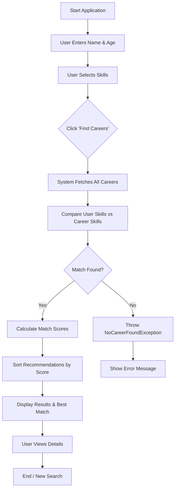
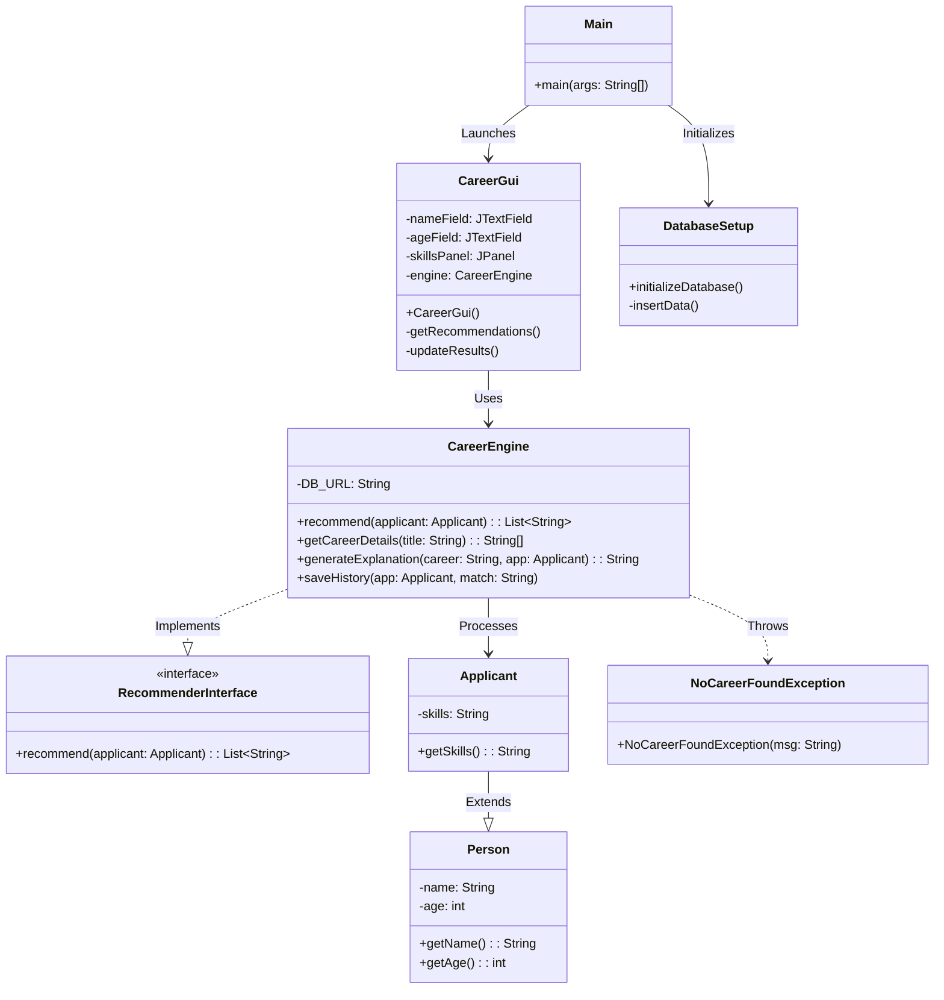

# Project Report: Career Recommender System

**Team Members:**
1. [Name] - [Roll Number]
2. [Name] - [Roll Number]
3. [Name] - [Roll Number]

**Course:** [Course Name]
**Semester:** [Semester]
**Submission Date:** [Date]

---

## Abstract

The **Career Recommender System** is a Java-based desktop application designed to assist individuals in identifying suitable career paths based on their skills and age. In a rapidly evolving job market, choosing the right career can be overwhelming. This system solves this problem by analyzing a user's skill set and matching it against a comprehensive database of professions. Key features include a modern, dark-themed Graphical User Interface (GUI), a dynamic skill filtering system, and an intelligent recommendation engine that highlights the "Best Match" while providing detailed insights such as salary potential and difficulty levels. The application utilizes a SQLite database for data persistence and provides a history feature to track previous recommendations.

---

## Introduction

### Background and Motivation
Choosing a career is one of the most significant decisions in a person's life. Students and job seekers often struggle to align their skills with market demands. The motivation behind this project is to create a user-friendly tool that bridges the gap between personal competencies and professional opportunities. By automating the counseling process, the system provides instant, data-driven guidance.

### Objectives and Scope
The primary objective is to develop a robust application that:
- Accepts user details (Name, Age) and technical/soft skills.
- Matches these inputs against a pre-defined database of careers.
- Displays a ranked list of recommended careers.
- Provides detailed explanations for the top recommendation.

**Scope:** The current system focuses on a wide range of industries including Technology, Healthcare, Engineering, Business, and Arts. It is designed as a standalone desktop application but can be scaled to a web-based platform in the future.

---

## System Analysis and Design

### Requirement Analysis

**Functional Requirements:**
1.  **User Input:** The system must allow users to enter their name, age, and select multiple skills from a list.
2.  **Search & Filter:** Users should be able to search for specific skills within the selection panel.
3.  **Recommendation Engine:** The system must calculate a match score for each career based on the overlap between user skills and career requirements.
4.  **Display Results:** Recommendations must be displayed in descending order of relevance, with the top match highlighted.
5.  **History:** The system must save and display a history of past user queries.

**Non-Functional Requirements:**
1.  **Usability:** The interface should be intuitive, aesthetic (Dark Mode), and responsive.
2.  **Performance:** Recommendations should be generated in under 2 seconds.
3.  **Reliability:** The system should handle invalid inputs (e.g., non-numeric age) gracefully without crashing.
4.  **Data Persistence:** Career data and user history must be stored persistently using a database.

### System Design

### System Design

**Flowchart:**

**Class Diagram:**

---

## Implementation

The project is implemented in **Java** using the **Swing** library for the GUI and **SQLite** for the database.

### Java Code Modules

The system is composed of several Java classes, each serving a specific purpose in the application architecture. Below is a detailed explanation of each module:

#### 1. `Main.java`
-   **Purpose:** The entry point of the application.
-   **Functionality:** It contains the `main` method which initializes the database by calling `DatabaseSetup.initializeDatabase()` and then launches the graphical user interface by creating an instance of `CareerGui`.

#### 2. `CareerGui.java`
-   **Purpose:** Manages the Graphical User Interface (GUI) and user interactions.
-   **Key Features:**
    -   Extends `JFrame` to create the main application window.
    -   Implements a custom "Deep Dark" theme with neon green accents (`#1DB954`).
    -   **Components:** Contains text fields for Name and Age, a search bar for skills, and a scrollable checklist (`JCheckBox`) for skill selection.
    -   **Event Handling:** Listens for button clicks (e.g., "Find Careers", "View History") and updates the UI dynamically.
    -   **Custom Rendering:** Uses `Graphics2D` to draw custom buttons and glow effects for the "Best Match" result.
    -   **History Display:** Includes methods to fetch and display user history in a separate dialog window.

#### 3. `CareerEngine.java`
-   **Purpose:** The core logic engine that handles data processing and recommendations.
-   **Key Features:**
    -   Implements the `RecommenderInterface`.
    -   **`recommend(Applicant applicant)`:** The primary algorithm. It fetches all careers from the database, compares their required skills with the applicant's skills, calculates a match score, and returns a sorted list of recommendations.
    -   **`getCareerDetails(String title)`:** Retrieves specific details (salary, difficulty, description) for a given career.
    -   **`generateExplanation(...)`:** Generates an HTML-formatted string explaining *why* a specific career was recommended, highlighting matching skills and difficulty levels.
    -   **History Management:** Contains methods to `saveHistory`, `getHistory`, and `clearHistory` using SQL commands.
    -   **Logging:** Writes system activities and errors to `activity_log.txt`.

#### 4. `DatabaseSetup.java`
-   **Purpose:** Handles database initialization and data seeding.
-   **Functionality:**
    -   Connects to the SQLite database (`careers.db`).
    -   Creates the necessary tables: `careers` (stores profession details) and `history` (stores user sessions).
    -   **Data Seeding:** Populates the `careers` table with a comprehensive list of over 50 professions across various industries (Tech, Healthcare, Business, etc.) if the table is empty or reset.

#### 5. `Applicant.java`
-   **Purpose:** A model class representing the user seeking a recommendation.
-   **Structure:**
    -   Extends the `Person` class.
    -   Adds a `skills` attribute (String) to store the comma-separated list of selected skills.
    -   Provides a constructor to initialize the applicant's data and a getter method for skills.

#### 6. `Person.java`
-   **Purpose:** A base class representing a generic person.
-   **Structure:**
    -   Contains common attributes: `name` (String) and `age` (int).
    -   Demonstrates the concept of **Inheritance**, allowing `Applicant` to reuse this code.

#### 7. `RecommenderInterface.java`
-   **Purpose:** Defines a contract for recommendation logic.
-   **Structure:**
    -   Declares the `recommend(Applicant applicant)` method.
    -   Ensures that any future recommendation engine implements this standard method, promoting code modularity and the use of **Interfaces**.

#### 8. `NoCareerFoundException.java`
-   **Purpose:** A custom exception class.
-   **Functionality:**
    -   Extends `Exception`.
    -   Used to handle specific scenarios where the recommendation engine cannot find any suitable matches for the user's input, allowing the GUI to display a friendly error message instead of crashing.

#### 9. `AdminCLI.java`
-   **Purpose:** A command-line interface tool for system administrators.
-   **Functionality:**
    -   Allows admins to view all available skills in the database.
    -   Provides functionality to add new careers to the database dynamically without modifying the code.
    -   Useful for maintaining and expanding the system's data.

### Main Concepts Used

-   **Inheritance:** `Applicant` inherits from `Person`. `CareerGui` inherits from `JFrame`.
-   **Interfaces:** `CareerEngine` implements `RecommenderInterface`, ensuring a standard contract for recommendation logic.
-   **Exception Handling:** `try-catch` blocks are used extensively to handle `SQLException` and `NumberFormatException`. A custom `NoCareerFoundException` is thrown when logic fails to find a match.
-   **Collections Framework:** `ArrayList` is used to manage lists of skills and career results. `HashSet` is used to track selected skills efficiently.
-   **JDBC (Java Database Connectivity):** Used for all database operations.

### Outputs

*(Note: Please insert screenshots of the running application here)*

1.  **Main Interface:** Shows the input fields (Name, Age) and the scrollable list of skills.
2.  **Recommendation Results:** Shows the "Best Match" highlighted with a glow effect and the list of other suitable careers.
3.  **History View:** Shows the log of previous users and their top results.

---

## Conclusion & Future Work

### Achievements
We successfully developed a functional Career Recommender System that meets all specified requirements. The application features a professional, modern UI that distinguishes it from standard academic projects. The recommendation algorithm effectively filters careers based on user input, and the database integration ensures data is managed efficiently.

### Future Enhancements
1.  **Web Migration:** Port the application to a web-based platform using Spring Boot and React for wider accessibility.
2.  **Advanced Algorithm:** Implement Machine Learning models to predict career suitability based on more complex factors like personality traits (MBTI) and academic performance.
3.  **Cloud Database:** Move from SQLite to a cloud-based database (e.g., MySQL or PostgreSQL) to allow real-time updates and centralized data management.

---

## References

1.  **Java Documentation:** https://docs.oracle.com/en/java/
2.  **SQLite JDBC Driver:** https://github.com/xerial/sqlite-jdbc
3.  **Swing Tutorial:** https://docs.oracle.com/javase/tutorial/uiswing/
